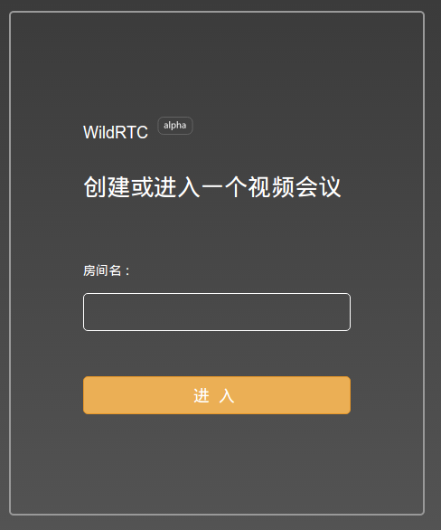
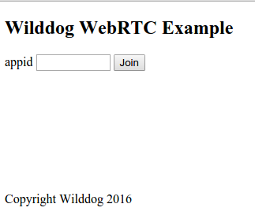

# lib-js-wildRTC - Wilddog 实现实时音视频聊天

使用 [Wilddog](https://www.wilddog.com) 实现的实时音视频聊天库。

野狗 wildRTC 项目的 [iOS SDK](https://cdn.wilddog.com/wildrtc/sdk/ios/WildRTC.framework-0.1.0.zip) 已经推出，Android SDK 即将推出。

## 浏览器支持
目前 wildRTC 可应用于以下 PC 端浏览器上：
- Chrome: 23+
- Firefox: 22+
- Opera: 18+
- Safari: 7.0+ (需要安装插件 & OSX 10.9+)

移动端浏览器：
- Android Browser: Android5.0+
- Opera for Android
- Chrome for Android
- Firefox for Android

## 在线示例

我们提供了一个实例，登录到同一个房间的用户之间能够进行实时音视频聊天。

[](https://wildrtc.wilddogapp.com/)

### 体验示例

打开网页 https://wildrtc.wilddogapp.com ，输入房间名，进入房间。在同一房间的用户之间能够互相视频聊天。

## 本地运行

### 下载代码

下载代码到本地，并进入`lib-js-wildRTC`目录

	git clone https://github.com/WildDogTeam/lib-js-wildRTC.git
	cd lib-js-wildRTC

### （可选）本地编译

如果想要自己对源码进行修改，或者担心 wildrtc 的依赖库有更新，想要升级 wildrtc.js ，建议重新编译生成 wildrtc.js:

	npm install
	gulp build

注意：如果没有安装 npm 或 gulp，请安装。

### 打开测试服务

	node https_channel_server.js

这会在本地 https://localhost:8080 建立一个 webserver，默认进入测试页面。

备注：使用 https 服务是由于在 chrome 浏览器中，必须使用 https 服务才能调用本地摄像头和麦克风。

### 进行测试

界面截图：



在测试页面输入 Wilddog 的 AppId，打开摄像头。同一 AppId 的不同用户将进入同一聊天室。

注意，由于 test.html 采用匿名登录，因此该 AppId 需要开启匿名登录功能。 

## 下载

要在你的工程中使用 WildRTC，你需要引用 cdn 中的 wildrtc.js ，或者将 lib 目录下的 wildrtc.js 拷贝到本地，并在你的 HTML 页面中引入以下文件：

```html
<!-- Wilddog -->
<script src="https://cdn.wilddog.com/js/client/current/wilddog.js"></script>

<!-- WildRTC -->
<script src="wildrtc.js"></script>
或
<script>src="https://cdn.wilddog.com/wildrtc/sdk/web/current/wildrtc.js"</script>
```

你也可以通过 npm 安装 WildRTC, 他们会自动下载依赖。

```bash
$ npm install wildrtc --save
```

## API 文档

### 创建引用

要使用 WildRTC，必须先创建 Wilddog 引用并登录或者匿名登录：

```js
var ref = new Wilddog("https://<appId>.wilddogio.com/");
ref.authAnonymously();
ref.onAuth(function(auth) {
    if (auth != null) {
        var rtc = new WildRTC(ref);
    }
}
```

<hr>

### 加入会话

创建 WildRTC 引用之后，就可以通过`join(callback)`进入会话：

```js
wildRTC.join(callback(err));
```
<hr>

### 监听远端媒体流

可以使用`on(type,callback,cancelCallback)`的事件监听来获取远端的媒体流。

```js
wildRTC.on("stream_added",function(WildStream){
	console.log(WildStream.getId());	//结果会在 console 中打印出远端 WildStream 的 id
})
```

回调函数的参数是一个 WildStream 对象类型，调用它的`getStream()`函数得到媒体流。上边这个例子中，`stream_added`这个事件会在每次收到远端 WildStream 时被触发。

同时，我们还提供`stream_removed`事件，用来监听远端停止发送 WildStream 的事件，并在回调函数中提供停止发送的远端WildStream 。

<hr>

### 获取本地媒体流

我们提供`getLocalStream(options,callback,cancelCallback)`来获取本地媒体流。

```js
wildRTC.getLocalStream(options,function(WildStream){
	console.log(WildStream.getId());	//结果会在 console 中打印出远端WildStream的Id
}, function(err){
	console.log(err);			//打印错误日志。
})
```

options 内容为设置获取媒体流的规格，为 JSON 字符串。可以传入`{"video":true|false, "audio":true|false}`来设置`video`和`audio`的开启情况。video 还可以设置帧率和分辨率，可以查看 docs 目录下的 API 文档。回调函数中的参数为 WildStream 对象类型。


<hr>

### 向远端发送媒体流

拿到 WildStream 后，通过`addStream(wildStream)`向远端其他用户发送媒体流。

```js
wildRTC.addStream(wildStream);
```

<hr>

### 媒体流与页面绑定

WildStream 对象提供`bindToDOM(element)`快速将媒体流与页面绑定。

```js
var self_view = document.getElementById('self_view');
wildStream.bindToDOM(self_view);
```

[更多API文档](./docs/api.md)

## 注册Wilddog

WildRTC 需要使用 Wilddog 数据库，你可以在此[注册](https://www.wilddog.com/my-account/signup) Wilddog 账户。

## TODO

- getLocalStream 支持更详细的配置 ： 进行中
- 多浏览器支持 ： 进行中

## 支持
如果在使用过程中有任何问题，请提 [issue](https://github.com/WildDogTeam/lib-js-wildRTC/issues) ，我会在 Github 上给予帮助。

## 相关文档

* [Wilddog 概览](https://z.wilddog.com/overview/introduction)
* [JavaScript SDK快速入门](https://z.wilddog.com/web/quickstart)
* [JavaScript SDK API](https://z.wilddog.com/web/api)
* [下载页面](https://www.wilddog.com/download/)
* [Wilddog FAQ](https://z.wilddog.com/questions)

## License
MIT
http://wilddog.mit-license.org/

## 感谢 Thanks

lib-js-wildRTC is built on and with the aid of several projects. We would like to thank the following projects for helping us achieve our goals:

Open Source:

* [JQuery](http://jquery.com) The Write Less, Do More, JavaScript Library
* [OpenWebRTC](http://www.openwebrtc.org/) A mobile-first WebRTC client framework for building native apps
* [WebRTC](https://webrtc.org/) WebRTC is a free, open project that provides browsers and mobile applications with Real-Time Communications (RTC) capabilities via simple APIs

